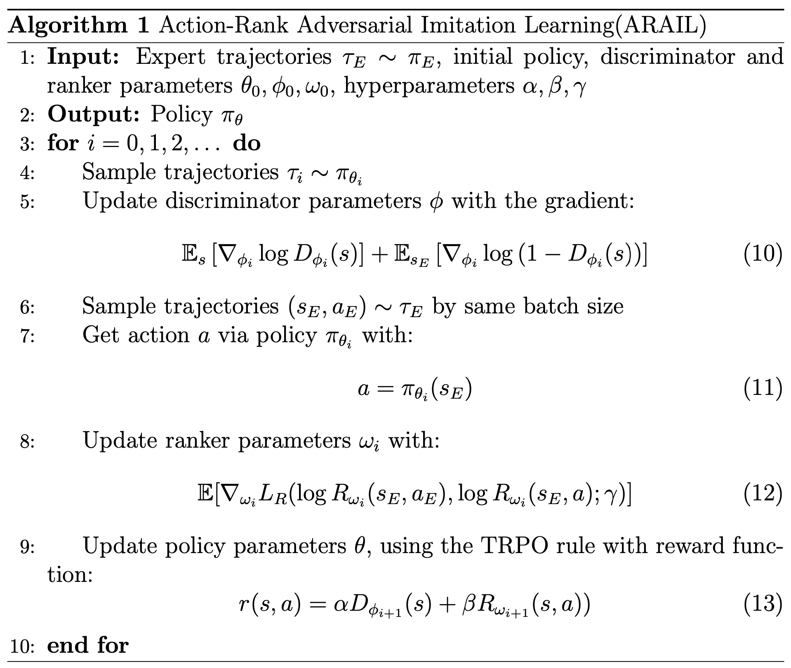
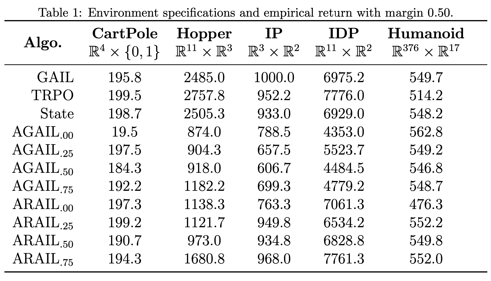
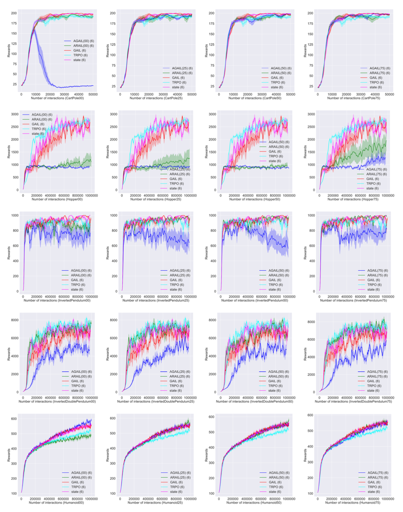
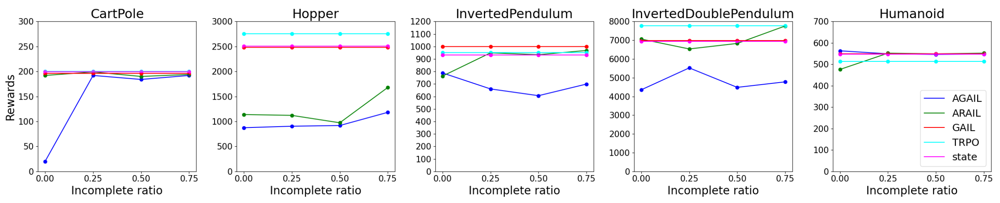
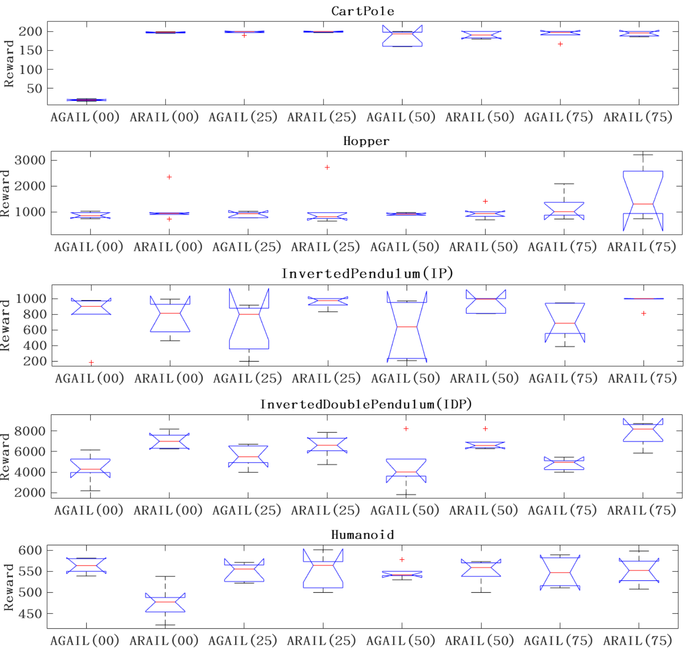
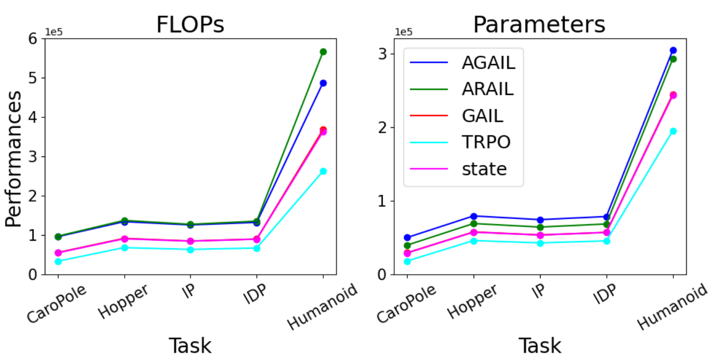

# **ARAIL**: Learning to Rank from Incomplete Demonstrations

**ARAIL** has been accepted for publication in Information Sciences.

[Paper](https://www.sciencedirect.com/science/article/abs/pii/S0020025521001213)

## Abstract

Generative Adversarial Imitation Learning (GAIL) has been successfully applied to imitation learning in control tasks. However, most GAIL-like approaches require complete and high-quality demonstrations that are scarcely available in practice, which leads to unsatisfactory performances. Researches have proposed algorithms for incomplete demonstrations, which, however, are supposed to be effective only when exceptionally high-quality demonstrations are provided. To solve the problem, the Action-Rank Adversarial Imitation Learning (ARAIL) algorithm is introduced to target the issue of incomplete demonstrations. By reconstructing the standard GAIL framework and introducing the ranker model, ARAIL reshapes the reward function from the discriminator and auxiliary information from the ranker. The primary insight is that the ranker makes a better assessment of missing actions, which in turn helps to learn a better policy. We empirically compare our approach with SOTA algorithms on Atari and Mujoco platforms with imitation learning benchmarks, demonstrating that ARAIL improves both performance and robustness on various levels of incompleteness of actions in demonstrations.

## Contribution

- We propose and evaluate an extension of GAIL that reshapes the reward function to optimize a policy with incomplete demonstrations.
- We introduce learning to rank mechanism as the ranker model to rank state-action pairs to provide better additional rewards for missing actions.
- We change the discriminator objective to comparing state trajectories from incomplete demonstrations against the generated state trajectories.
- We show the performances for demonstrations of various levels of incomplete ratio and for tasks of various levels of complexities.

## ARAIL Framework

**The overview of the proposed ARAIL method:**


A learning agent in reinforcement learning is supposed to sense the state of the environment to some extent and take actions to affect the environment. The State and the Action in the figure are some numerical values that represent the current state of the environment and action taken by the agent. Imitation learning involves an agent acting with expert demonstrations, without the need for the environment's signal of any kind. Consisting of state trajectories and action trajectories, the Demonstrations in the figure are experience items that instruct the agent to perform well in tasks. **Left:** The illustration of State-GAIL. State trajectories are for State-GAIL, which are separated from demonstrations, to learn a policy, and match the agent policy to the expert policy. **Right:** The illustration of the ranker. Action trajectories are separated from demonstrations to provide auxiliary rank information. Take state trajectories as the input of policy to get the mixed trajectories, which combine state trajectories and policy actions. And then rank demonstrations and mixed trajectories to optimize the policy. 

## Algorithm



## Experimence on ARAIL

### Performance comparison





Reward curves of TRPO(Cyan), State-GAIL(Magenta), GAIL(Red), AGAIL(Blue, incomplete ratio from left to right: 0.00, 0.25, 0.50, 0.75) and ARAIL(Green, incomplete ratio from left to right: 0.00, 0.25, 0.50, 0.75, Margin:0.50) in the tasks of Cart- Pole, Hopper, InvertedPendulum, InvertedDoublePendulum, and Humanoid(from top to bottom).

### Robustness evaluation



Robustness evaluation of TRPO, GAIL, State-GAIL, AGAIL(incomplete ratio: 0.00, 0.25, 0.50, 0.75) and ARAIL(incomplete ratio: 0.00, 0.25, 0.50, 0.75) in the tasks of CartPole, Hopper, InvertedPendulum, InvertedDoublePendulum, and Humanoid(from left to right).

### Analysis of significance difference



Reward boxplot graphs of AGAIL(incomplete level from left to right: 0.00, 0.25, 0.50, 0.75) and ARAIL(incomplete level from left to right: 0.00, 0.25, 0.50, 0.75, Margin:0.50) in the tasks of CartPole, Hopper, InvertedPendulum, InvertedDoublePendulum, and Humanoid(from top to bottom). These boxplot graphs illustrate the dispersal of data.

### Analysis of computation complexity



## Citation

```
@article{XU2021,
title = {ARAIL: Learning to Rank from Incomplete Demonstrations},
journal = {Information Sciences},
year = {2021},
issn = {0020-0255},
doi = {https://doi.org/10.1016/j.ins.2021.02.001},
url = {https://www.sciencedirect.com/science/article/pii/S0020025521001213},
author = {Dayong Xu and Fei Zhu and Quan Liu and Peiyao Zhao},
keywords = {Imitation learning, Learning to rank, Incomplete demonstrations, Auxiliary rank information}
}
```