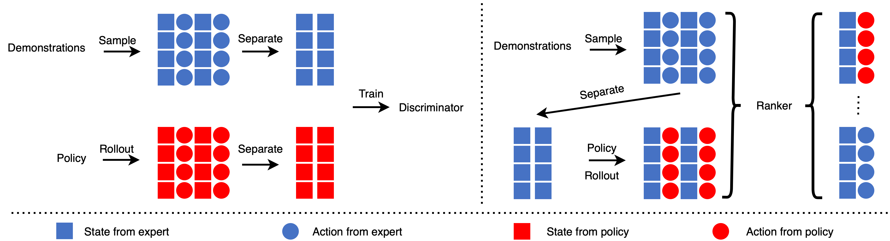

# **ARAIL**: Learning to Rank from Incomplete Demonstrations 

## ARAIL Framework

**The overview of the proposed ARAIL method:**



A learning agent in reinforcement learning is supposed to sense the state of the environment to some extent and take actions to affect the environment. The State and the Action in the figure are some numerical values that represent the current state of the environment and action taken by the agent. Imitation learning involves an agent acting with expert demonstrations, without the need for the environment's signal of any kind. Consisting of state trajectories and action trajectories, the Demonstrations in the figure are experience items that instruct the agent to perform well in tasks. **Left:** The illustration of State-GAIL. State trajectories are for State-GAIL, which are separated from demonstrations, to learn a policy, and match the agent policy to the expert policy. **Right:** The illustration of the ranker. Action trajectories are separated from demonstrations to provide auxiliary rank information. Take state trajectories as the input of policy to get the mixed trajectories, which combine state trajectories and policy actions. And then rank demonstrations and mixed trajectories to optimize the policy. 

## How to use

1. Download expert data from [Google Drive](https://drive.google.com/file/d/11TWL1gdqXwz-pDRW_hlPpNFJZBFRkM_5/view?usp=sharing). Unzip and place it in the scripts folder (i.e., *scripts/expert_data/*)

2. Running training shell scripts

   ```shell
   sh run_cartpole_0.00.sh
   sh run_hopper_0.00.sh
   sh run_humanoid_0.00.sh
   ```

3. Plotting curves.

   ```shell
   python3 plot_curve.py --env_id Hopper --timesteps 5000000
   ```

# Requirements

- Python 3
- [OpenAI-Baselines](https://github.com/openai/baselines)
- [Mujoco](https://github.com/openai/mujoco-py)

## Citation

## Reference

- [@openai/baselines](https://github.com/openai/baselines)
- [@WenlongZhang0517/RankSRGAN](https://github.com/WenlongZhang0517/RankSRGAN)
- [@mingfeisun/agail](https://github.com/mingfeisun/agail)

